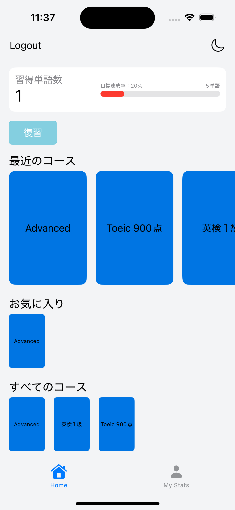
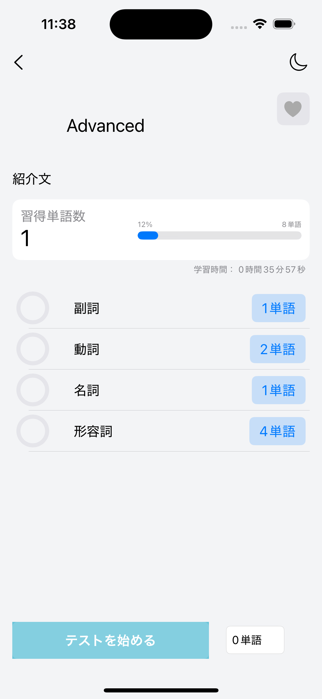
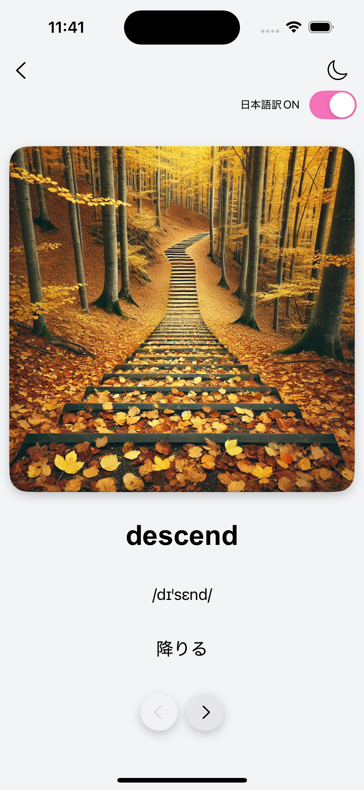
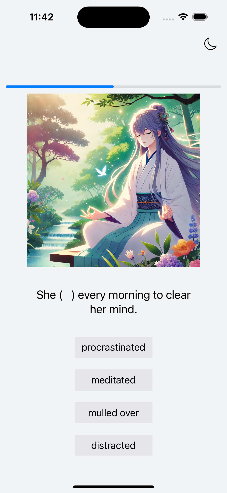
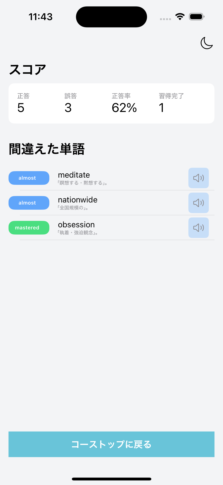

# イメージラーニング英単語アプリ（開発中）

このアプリは、**視覚イメージ（イラスト）を活用した英単語学習**を支援するiOSアプリです。  
ユーザーの学習目的に合わせた複数のコースを用意し、  
「学習フェーズ」と「テストフェーズ」を通じて語彙の定着を図ります。

>  **現在開発中です。将来的な商用利用を視野に入れているため、ソースコードは非公開としています。**

---

## アプリ画面イメージ

> ※以下は一部の画面キャプチャです（開発中のものを含む）

| トップ画面 | コース詳細 | 学習フェーズ | テストフェーズ | リザルト画面 |
|------------|------------|---------------|----------------|----------------|
|  |  |  |  |  |

---

## 主な機能

### トップ画面
- 習得単語数を表示
- 学習目的に応じたコース表示（「最近のコース」「お気に入り」「すべてのコース」）

### ユーザー情報
- 目標単語数の設定
- 習得単語の記録やTOEIC予想スコア機能（開発中）

### コース詳細・単語一覧
- コース名・内容の表示
- プログレスバーとお気に入り登録
- 品詞ごとの単語一覧にアクセス可能
- 「テスト開始」から理解度チェック・習得度の更新が可能

### 学習フェーズ
- イラスト + 単語情報で視覚的に単語を学習

### テストフェーズ
- イラスト + 穴埋め文章 + 選択肢（4択）
- 習得度が低い単語から出題
- 正誤に応じた画面遷移（正解→次、誤答→学習画面）
- 結果画面でスコア・正答率・習得語数を確認
- 間違えた単語一覧から学習フェーズへ再アクセス可能

---

## 今後の開発予定
- ユーザーの習得単語数推移の記録
- 習得度に応じた復習機能の実装
- 学習フェーズにおける日本語訳On/Off機能の実装
- コース別の収録単語の選定

---

## 注意事項
このリポジトリには**アプリ本体のソースコードは含まれておりません**。  
商用利用を前提としているため、コードの公開は予定していません。

---

## お問い合わせ
ご質問・ご要望等がございましたら、[Issues](https://github.com/shadanki/english-app-info-jp/issues)またはメール([seiyakawano05410@gmail.com](mailto:seiyakawano05410@gmail.com))にてご連絡ください。
